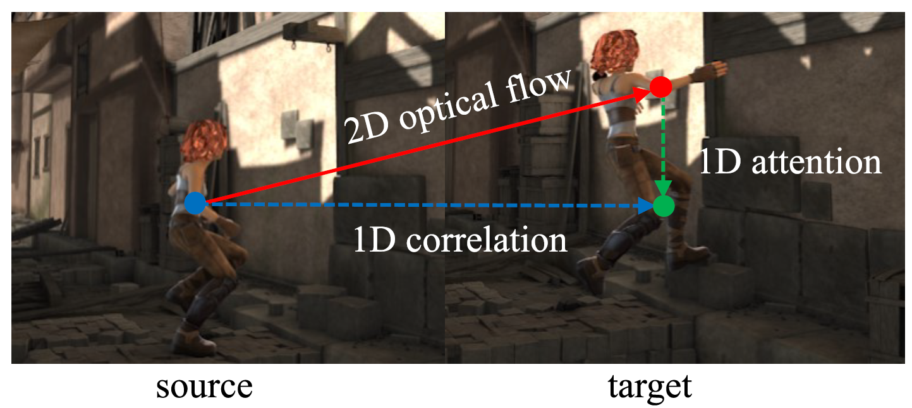
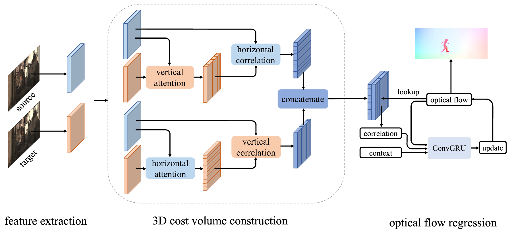

# Flow1D

Official PyTorch implementation of paper:

[**High-Resolution Optical Flow from 1D Attention and Correlation**](https://arxiv.org/abs/2104.13918), **ICCV 2021, Oral**

Authors: [Haofei Xu](https://scholar.google.com/citations?user=NhUwq_8AAAAJ), [Jiaolong Yang](https://jlyang.org/), [Jianfei Cai](https://jianfei-cai.github.io/), [Juyong Zhang](http://staff.ustc.edu.cn/~juyong/), [Xin Tong](https://scholar.google.com/citations?user=P91a-UQAAAAJ&hl=en&oi=ao)


We enabled **4K resolution** optical flow estimation by factorizing 2D optical flow with 1D attention and 1D correlation.


<p align="center"></p>


The full framework:


<p align="center"></p>


## Installation

Our code is based on pytorch 1.7.1, CUDA 10.2 and python 3.7. Higher version pytorch should also work well.

We recommend using [conda](https://www.anaconda.com/distribution/) for installation:

```
conda env create -f environment.yml
conda activate flow1d
```

## Demos

All pretrained models can be downloaded from [google drive](https://drive.google.com/file/d/1IzcmvxpY90DuXYkGkwitxslO1Psq52OI/view?usp=sharing).


You can run a trained model on a sequence of images and visualize the results:

```
CUDA_VISIBLE_DEVICES=0 python main.py \
--resume pretrained/flow1d_highres-e0b98d7e.pth \
--val_iters 24 \
--inference_dir demo/dogs-jump \
--output_path output/flow1d-dogs-jump
```

More examples can be found in [scripts/demo.sh](scripts/demo.sh).


## Datasets

The datasets used to train and evaluate Flow1D are as follows:

* [FlyingChairs](https://lmb.informatik.uni-freiburg.de/resources/datasets/FlyingChairs.en.html#flyingchairs)
* [FlyingThings3D](https://lmb.informatik.uni-freiburg.de/resources/datasets/SceneFlowDatasets.en.html)
* [Sintel](http://sintel.is.tue.mpg.de/)
* [KITTI](http://www.cvlibs.net/datasets/kitti/eval_scene_flow.php?benchmark=flow)
* [HD1K](http://hci-benchmark.iwr.uni-heidelberg.de/) 

By default the dataloader [datasets.py](data/datasets.py) assumes the datasets are located in folder `datasets` and are organized as follows:

```
datasets
├── FlyingChairs_release
│   └── data
├── FlyingThings3D
│   ├── frames_cleanpass
│   ├── frames_finalpass
│   └── optical_flow
├── HD1K
│   ├── hd1k_challenge
│   ├── hd1k_flow_gt
│   ├── hd1k_flow_uncertainty
│   └── hd1k_input
├── KITTI
│   ├── testing
│   └── training
├── Sintel
│   ├── test
│   └── training
```

It is recommended to symlink your dataset root to `datasets`:

```shell
ln -s $YOUR_DATASET_ROOT datasets
```

Otherwise, you may need to change the corresponding paths in [datasets.py](data/datasets.py).


## Evaluation

You can evaluate a trained Flow1D model by running:

```
CUDA_VISIBLE_DEVICES=0 python main.py --eval --val_dataset kitti --resume pretrained/flow1d_things-fd4bee1f.pth --val_iters 24
```

More evaluation scripts can be found in [scripts/evaluate.sh](scripts/evaluate.sh).


## Training

All training scripts on FlyingChairs, FlyingThings3D, Sintel and KITTI datasets can be found in [scripts/train.sh](scripts/train.sh).

Note that our Flow1D model can be trained on a single 32GB V100 GPU. You may need to tune the number of GPUs used for training according to your hardware. 


We support using tensorboard to monitor and visualize the training process. You can first start a tensorboard session with

```shell
tensorboard --logdir checkpoints
```

and then access [http://localhost:6006](http://localhost:6006) in your browser.


## Citation

If you find our work useful in your research, please consider citing our paper:

```
@inproceedings{xu2021high,
  title={High-Resolution Optical Flow from 1D Attention and Correlation},
  author={Xu, Haofei and Yang, Jiaolong and Cai, Jianfei and Zhang, Juyong and Tong, Xin},
  booktitle={Proceedings of the IEEE/CVF International Conference on Computer Vision},
  pages={10498--10507},
  year={2021}
}
```


## Acknowledgements

This project is heavily based on [RAFT](https://github.com/princeton-vl/RAFT). We thank the original authors for their excellent work.


